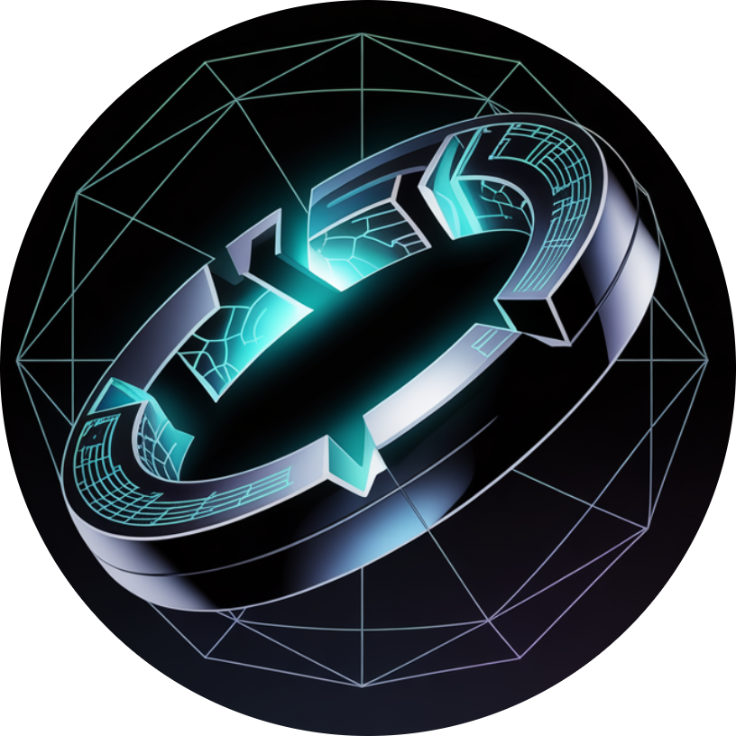

<p align="center">
   
</p>

<div align="center">

[](https://github.com/ParaDarkOfficial/ParaDark/graphs/contributors)
[](https://github.com/ParaDarkOfficial/ParaDark/stargazers)
[](./LICENSING.md)

</div>

# Welcome to **ParaDarkOfficial**
> Where myths evolve — together.

**ParaDarkOfficial** is an open-source collaborative mythology universe built by a creative community of **writers, artists, and developers**.  
Every story, artifact, and character is forged right here on **GitHub** — shaping an ever-expanding multiverse of legends.

---

## The Beginning of the Universe

The official origin story of our world is now live:  
  [**Read: The First Spark**](/lore/canon/myths/The_first_spark.md)

It tells the story of the Quantum Reactor accident that fractured the Prime Dimension and scattered 100 **Shards of Worlds** across reality.

---

### Your Mission: Hunt the Shards!

Our origin story, "[The First Spark](/lore/canon/myths/The_first_spark.md)," ended with the **Prime Reactor Core shattering into 100+ "Shards of Worlds."** These shards have scattered across the **[Prime Dimension](/lore/canon/locations/prime-dimension.md)** and maybe even *other dimensions* entirely!

**What do these shards do?**
* They grant **superpowers** to whoever finds them. 
* They can warp reality, creating **anomalies** or **monsters**. 
* They are pieces of immense power, and now **heroes AND villains** are desperately trying to collect them! ⚔️

**This is where YOU come in.** Our goal is to tell the stories of **all 100+ shards.**

**Your contribution is simple:**

1.  **Invent a Shard:**
    * Think of a cool power or effect one small shard could have.
    * **Action:** Add your new shard description as a `.md` file in the `/lore/community/artifacts/` folder. Use the template!

2.  **Decide Who Finds It:**
    * Is it a random person? An animal? Who gets the power or is affected? Does a hero or villain take the shard from them?
    * **Action:** If you create a new character, add their bio as a `.md` file in `/lore/community/characters/`.

3.  **Decide Where:**
    * Did it land in Prime City? A hidden dimension? Bielefeld? A place *you* invent?
    * **Action:** If you create a new location, add its description as a `.md` file in `/lore/community/locations/`.

4.  **Write the "Episode":**
    * Tell the short story (1-2 pages) of what happens when that shard is found and activated.
    * **Action:** Add your story as a `.md` file in the `/lore/community/myths/` folder.

**Every shard is a new story. Every story is a contribution.** We need *your* ideas to build this universe, one shard at a time!

**Ready to add your shard story?**
**[Check out our simple Contribution Guide](CONTRIBUTING.md)**
**[See the tasks we need help with!](../../issues)** *(Make sure this link goes to your Issues tab)*

---

Writers and coders can now expand the world through the `/lore/community/` folder:
- Characters → `/lore/community/characters/`
- Locations → `/lore/community/locations/`
- Artifacts → `/lore/community/artifacts/`
- Myths (short stories) → `/lore/community/myths/`

---

## What is ParaDarkOfficial?

A **living mythology** where:
- **Writers** craft characters, myths, and worlds
- **Developers** build interactive lore platforms
- **Artists** visualize the multiverse *(coming soon)*
- **Everyone** shapes the canon through community contributions

Unlike traditional stories, **MythiQ evolves through pull requests** — every accepted contribution becomes part of the official multiverse.

---

## Quick Start

### For Readers
1. Browse the **[Official Canon Lore](/lore/canon/)**
2. Explore **[Community Creations](/lore/community/)**
3. Discover connections between stories and worlds

### For Contributors
Want to add your own myth or build features?  
    **[See CONTRIBUTING.md](./CONTRIBUTING.md)** for step-by-step guides

---

## Project Structure

```
mystiQ-universe/
├── app/              # Next.js frontend (interactive lore platform)
├── lore/
│   ├── canon/        # Official universe mythology
│   │   ├── myths/
│   │   ├── characters/
│   │   └── locations/
│   └── community/    # Fan-created stories (reviewed before merging)
│       ├── characters/
│       ├── locations/
│       ├── artifacts/
│       └── myths/
├── CONTRIBUTING.md   # How to contribute
└── README.md         # You are here
```

---

## Tech Stack

- **Frontend:** Next.js + React + Tailwind CSS
- **Content:** Markdown-based lore system
- **Backend:** Python + FastAPI *(coming soon)*
- **AI Features:** Story generators, lore search *(roadmap)*

---

## Why Join ParaDarkOfficial?

- **No gatekeeping** — Every good idea gets reviewed fairly
- **Your lore becomes canon** — Merged stories are part of the official universe
- **Get credited in books** — If we publish, you're acknowledged as a contributor
- **Open-source mythology** — Built by the community, for the community
- **Cross-platform potential** — Stories can become games, art, or interactive experiences
- **Protected from exploitation** — Non-commercial license prevents unauthorized commercial use

> **"The world doesn't end with legends — it begins with them."**

---

## How to Contribute

We welcome:
- **Lore Writers** — Add myths, characters, locations, artifacts
- **Developers** — Build features, fix bugs, improve the platform
- **Artists** — Visualize characters and worlds *(accepting contributions)*
- **Translators** — Help make lore accessible globally *(future)*

  **[Read the Full Contribution Guide](./CONTRIBUTING.md)**

### Important: Licensing for Contributors

By contributing to ParaDarkOfficial, you agree that:

- **Your lore contributions** are licensed under **CC BY-NC-SA 4.0**
  - **You retain credit** — Your name stays in commit history and lore files
  - **Non-commercial sharing** — Fans can share your work, but not sell it
  - **MystiQ-Universe can use commercially** — We can include your lore in official books/games (with attribution to you)
  
- **Your code contributions** are licensed under **MIT License**
  - Fully open for anyone to use and modify

**Why this matters:**
- You get **credited** for your creative work
- Your lore becomes part of **official canon**
- MystiQ-Universe can publish **books and games** featuring your contributions (you'll be credited!)
- Protects the universe from unauthorized commercial exploitation

   **[Read Full Licensing Details](./LICENSING.md)**

---

## Community Guidelines

- Be respectful and constructive
- Credit sources and inspirations
- Maintain mythic consistency with the universe tone
- One clear change per pull request
- No plagiarism or uncredited content

---

## Quick Links

- [Official Canon Lore](/lore/canon/)
- [Community Submissions](/lore/community/)
- [Contribution Guide](./CONTRIBUTING.md)
- [Licensing Information](./LICENSING.md)
- [Open Issues](../../issues)
- [Project Roadmap](../../projects) *(coming soon)*

---

## Stay Connected

- **Discussions:** [GitHub Discussions](../../discussions)
- **Issues & Suggestions:** [Issue Tracker](../../issues)

---

**Created with ❤️ by the MythiQ Community**

> Join the universe. Shape the myth. Become legend.
